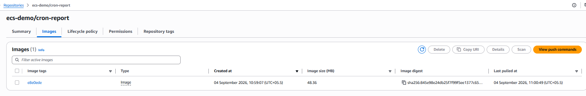
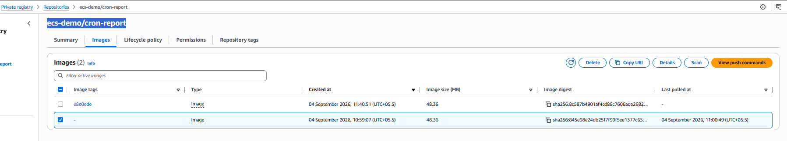

# ECR Image Tagging — Problem & Solution

## Problem

After re-running the "Build and Push Images to ECR" pipeline, older image tags disappeared from the ECR repository (`ecs-demo/cron-report`) 

Before:


After rerun:


### Root causes identified

- **Tag reuse on re-run of the same commit**
  - Image tag was set from the short git SHA: `IMAGE_TAG=${GITHUB_SHA::7}`.
  - Re-running the workflow (`workflow_dispatch`) without a new commit means `GITHUB_SHA` is identical to the previous run.
  - ECR repositories are **mutable by default** — pushing to an existing tag does not create a new tagged image, it **overwrites the tag pointer** to the new digest.
  - The image the tag previously pointed to isn't deleted, but it becomes **untagged / orphaned** (shown as `-` in the Image tags column).

- **Active lifecycle policy silently cleaning up**
  - A lifecycle policy was running in the background, expiring untagged and/or excess tagged images.
  - This was actively reducing the image count before it was manually deleted, which is why the drop looked sudden.

- **Fewer manifests per push (secondary factor)**
  - Buildx by default pushes both an image manifest and an attestation/provenance (SBOM) manifest (`Image Index` + `Other` types).
  - If `provenance`/`sbom` are disabled, each push produces one manifest instead of two, so the repo naturally accumulates fewer rows per run even without any deletion happening.

### Why this matters

- Rolling back to "the image from 3 deploys ago" becomes unreliable if that image's tag has already been silently overwritten by a later run on the same commit.
- Debugging "which image is actually running in production" becomes ambiguous when tags are mutable and reused.

## Solution — How real organizations handle this

### 1. Multi-tag strategy (push several tags per build, same digest)

```yaml
tags: |
  ${{ registry }}/${{ repo }}:${{ github.sha }}                          # full SHA - immutable audit trail
  ${{ registry }}/${{ repo }}:${{ github.sha }}-${{ github.run_number }} # unique per pipeline run
  ${{ registry }}/${{ repo }}:${{ env.BRANCH_NAME }}                     # rolling pointer per branch
  ${{ registry }}/${{ repo }}:${{ steps.version.outputs.semver }}        # e.g. v2.4.1, for actual releases
```

- **Full SHA** — used by deploy manifests (ECS task defs, Helm, Terraform) for exact traceability back to a commit; avoids short-SHA collision risk at scale.
- **SHA + run number** — guarantees a unique tag even when re-running the same commit.
- **Branch tag** — rolling pointer per environment/branch, instead of a single global `latest`.
- **Semver tag** — for genuine releases, cut from a git tag, not every commit.
- Many organizations **avoid using `:latest`** in production repos entirely, since it's the main source of "which image is actually running" confusion.

### 2. Enable immutable tags on the ECR repository

- Set **Image tag mutability = Immutable** on repos beyond dev/sandbox.
- A second push to an existing tag is then **rejected outright** by ECR, instead of silently overwriting it.
- This forces CI to always mint a genuinely new tag per build — enforcing the discipline described above at the infrastructure level, not just by convention.
- **Trade-off:** a `buildcache` tag needs to be overwritten every run, which breaks under immutable mode. Standard fix: keep build cache in **GitHub Actions cache (`type=gha`)** instead of pushing a `buildcache` tag into the same (now-immutable) release repo — or push cache to a separate, mutable-tagged cache-only repo.

### 3. Deployments reference the immutable digest or full SHA — never a mutable tag

- ECS task definitions, Helm values, and Terraform configs should pin to `image@sha256:...` or the full commit SHA tag — never `:latest` or a branch tag.
- This ensures the deploy path can never be affected by a mutable/convenience tag being reassigned or pruned later.

### 4. Lifecycle policy — always on, managed as code

- Kept permanently active (not manually toggled), typically with two rules:
  - Expire **untagged** images after a short grace window (e.g. 7 days) — cleans up orphaned tags and cache blobs.
  - Keep the **last N tagged** images — bounds repo growth while preserving a rollback window.
- Applied via Terraform/CDK across **all service repos at once**, rather than manually configured per repo in the console — required once there are more than 2–3 services/repos to manage.

### 5. Rollback relies on deploy/release history, not the ECR image list

- ECR is treated as a **content-addressable artifact store with a retention window**, not a permanent audit log.
- The actual audit trail is git history + CI workflow run history + deployment history (e.g. ECS task definition revisions, ArgoCD/Helm release history) — all referencing the SHA, which stays reproducible even if the built artifact is eventually pruned.

## Summary comparison

| Area | Before (current setup) | After (org best practice) |
|---|---|---|
| Tagging | Mutable tag, short SHA only, reused on re-run | Immutable tags: full SHA + run number + branch + semver |
| Repo mutability | Mutable (default) | Immutable, enforced at repo level |
| Build cache | `buildcache` tag pushed into same repo | Moved to GitHub Actions cache (`type=gha`) or a separate cache-only repo |
| Lifecycle policy | Manually toggled on/off | Always-on, IaC-managed across all repos |
| Deploy reference | Likely `:latest` or short-SHA tag | Full SHA or digest — never a mutable tag |
| Rollback method | Scrolling through ECR image list | Deploy/release history (task def revisions, Helm/Argo releases) |