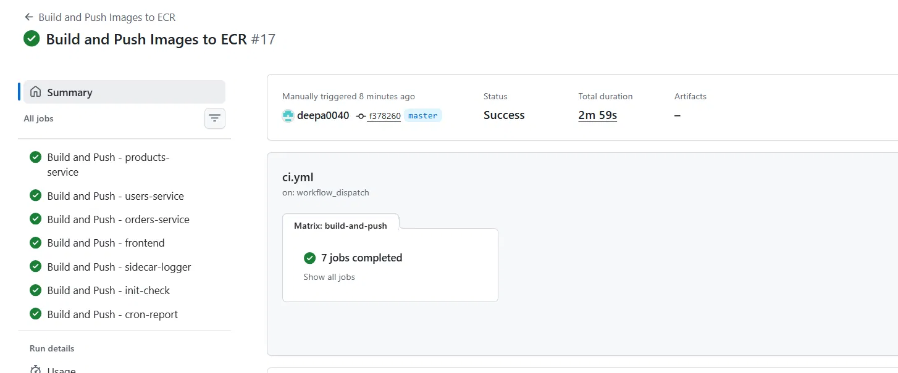
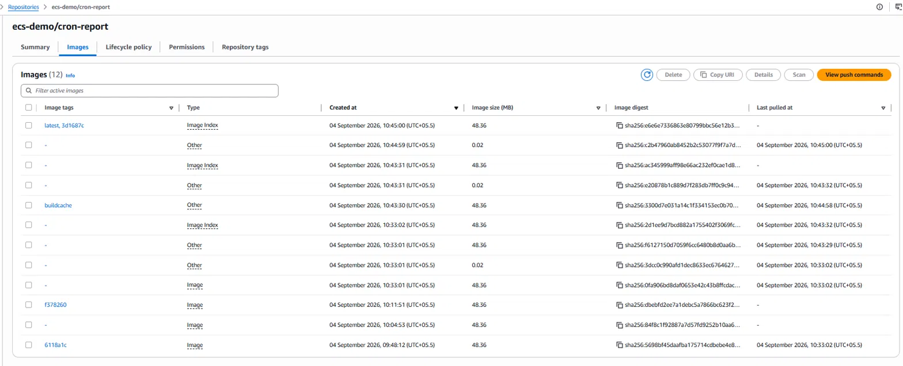
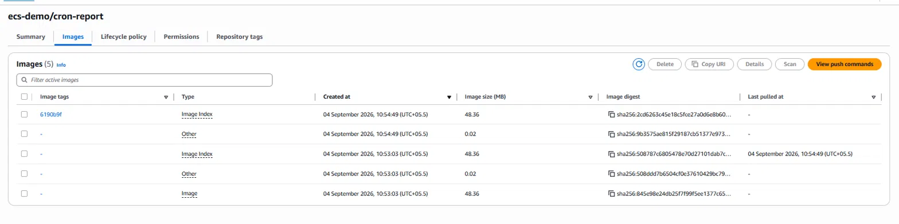
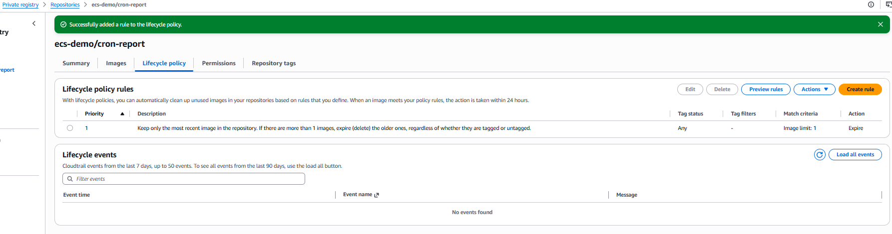

# Docker Image Build Caching — GitHub Actions + ECR

## Problem

- GitHub Actions runners are **ephemeral VMs** — a fresh machine spins up for every workflow run, with no local disk state carried over.
- Docker's normal layer cache lives on local disk, so on ephemeral runners **every build was a full cold build**, even when only one file changed.
- Original workflow used plain `docker build` / `docker push` CLI commands — no cache support at all, no Buildx.
- Result: all 7 matrix jobs (products-service, users-service, orders-service, frontend, sidecar-logger, init-check, cron-report) rebuilt every layer from scratch on every run, wasting time even for trivial changes.

## Why this matters

- 7 parallel matrix jobs ≠ combined runtime. Each job runs on its **own VM in parallel**, and total workflow duration = the **slowest job**, not the sum of all 7.
- But without caching, "parallel" didn't help much — every single job was still doing a full rebuild, so total time stayed high regardless of matrix size.

## Solution — Step 1: Switch to Buildx with registry-based cache

- Replaced plain `docker build`/`docker push` steps with `docker/build-push-action@v6` (built on Buildx).
- Added `docker/setup-buildx-action@v3` — required because plain `docker build` CLI has no `cache-from`/`cache-to` support.
- Used `cache-from`/`cache-to: type=registry` pointed at a dedicated `:buildcache` tag **per service repo** in ECR.
- **Why registry cache first:** simplest to reason about, no size cap (unlike GitHub's cache), works the same from any runner (hosted or self-hosted later).

### Side effect discovered
- ECR repo image list got cluttered — `buildcache` tag, `Image Index` entries, old plain `Image` entries, and small attestation blobs all mixed together (went from a handful of images to 12+ per repo).
- This is expected behavior of `type=registry` caching — every build pushes/updates cache data alongside the real image, and nothing auto-cleans old untagged layers.

## Solution — Step 2: Move cache off ECR to GitHub Actions cache (`type=gha`)

- Switched `cache-from`/`cache-to` to `type=gha`, with **`scope: ${{ matrix.service }}`** set explicitly.
  - **Why scope matters:** without it, all 7 matrix jobs share one default GHA cache namespace and evict each other's layers. Scoping per service isolates each service's cache.
- Confirmed fix by re-checking ECR: `buildcache` tag disappeared from the repo entirely — cache moved to GitHub's storage as intended.
- Repo image count dropped from 12 → 5, only real image pushes + small attestation metadata remained (not cache).

## Key things learned / to remember

- **`Image Index` entries** = the actual deployable image manifest — always in ECR, expected, this is what ECS pulls.
- **Small ~0.02MB `Other` entries** = Buildx provenance/SBOM attestation metadata, unrelated to caching, attached by default since `build-push-action@v5+`. 

It can be disable with `provenance: false` / `sbom: false` if not needed for compliance — otherwise fine to leave on.

- **`type=gha` cache is NOT visible in ECR** — verify it separately under repo → **Actions tab → Caches**, watch for per-service scoped entries.
- **`type=gha` has a 10GB cache limit shared across the whole repo** (all 7 services' scopes count against this same cap) — GitHub silently evicts oldest caches when exceeded or unused for 7 days. Worth monitoring as service count grows.
- **`type=registry` has no size cap** but requires manual cleanup (ECR lifecycle policy) to avoid clutter — trade-off between the two approaches.

## Other best practices flagged for later

- Add an **ECR lifecycle policy** (per repo, or via IaC across all 7) to auto-expire untagged images and cap tagged image count — needed regardless of which cache backend is used, since old image pushes still accumulate over time.

- Use `RUN --mount=type=cache` inside Dockerfiles for package manager caches (npm/pip/apt) — helps even on fully cold builds.
- Add path filtering so only changed services rebuild, instead of all 7 every run.
- Pin base images by digest (not floating tags) for reproducible, cache-stable builds.
- Deploy ECS off the SHA tag, not `:latest`, to avoid ambiguity about what's actually running.
- Enable ECR scan-on-push (or Trivy in CI) as a required check before deploy.